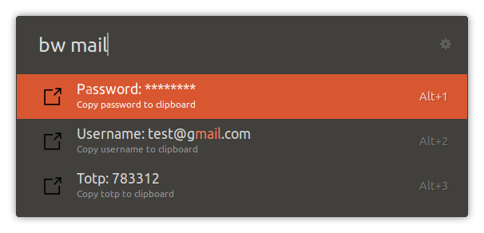

# ulauncher-bitwarden

A [Ulauncher](https://ulauncher.io/) extension to search your [Bitwarden](https://bitwarden.com/) vault and copy passwords to the clipboard.

## Features

- Quickly search through the database entries by name, and copy passwords/usernames/URLs/TOTPs to the clipboard
- Works also with self hosted Bitwarden servers.
- Support vaults with a passphrase also with MFA codes. The extension does not keep the password in the memory.
It rather uses SessionID generated by the Bitwarden CLI client.

## Requirements

- Install a recent version of [Bitwarden CLI](https://github.com/bitwarden/cli)
- Make sure you can execute `bw` in a terminal

## Installation

Open Ulauncher preferences window -> Extensions -> "Add extension" and paste the following url:

```
https://github.com/kbialek/ulauncher-bitwarden
```

## Configuration

- `Bitwarden Server Url`
- `User e-mail address`
- `Enable MFA login` - if you use MFA authentication with your Bitwarden account select `yes`, otherwise leave `no` 
- `Inactivity lock timeout` - forces you to re-enter the passphrase after you haven't used the extension for a while. By default it's set to 300 seconds (5 minutes). If you'd rather not re-enter it, you can set the value to 0, but that's probably not a great idea. NOTE: The cached passphrase is only stored in memory, so you'll need to re-enter it if you reboot your computer or restart Ulauncher.
- `Session store command` - optional command called after successful login or unlock. Bitwarden session key is passed over stdin. 
You can use it to run a command which will store session key in "some" secure location, 
and later read the session key when directly calling `bw` in the cli. 
It's totally up to you how and where you will store the session key.

## Usage

Open Ulauncher and type in "bw " to start the extension. If your password database is locked with a passphrase, it'll ask you to enter it:


Once unlocked, search the database for "mail" logins:


Look at the `GMail` entry:



## Exporting Session Key
The extension keeps the session key in memory. This is a problem when one wants to use `bw` directly from the
command line. Vault must be unlocked and bw-cli creates a new session key and at this same time invalidates 
the session key stored by the extension.

To overcome this problem the extension is now able to export the session key after a successful login or unlock.
Please keep in mind, that this weakens your vault's security, as the session key is easier to intercept when
it's stored outside of the extension memory.

### Exporting session key into a file
I do not recommend this solution because it leaves valid session key in the file until vault is explicitly locked.

To store session key in a file use the following script.
```shell script
#!/bin/bash

BW_SESSION_FILE=$HOME/.bw-session
touch $BW_SESSION_FILE
chmod 600 $BW_SESSION_FILE
cat /dev/stdin > $BW_SESSION_FILE
```
`Session store command` property must be set to absolute path of the script.

Now you can use it in the command line
```shell script
export BW_SESSION=$(cat ~/.bw-session)
bw list items
```

### Exporting session key into Kernel Key Management
Linux kernel comes with key management facility, that can be used to store user secrets.
For more details read [this](https://github.com/jdukes/pykeyctl/blob/master/docs/Overview.org) page.

To store session key in the kernel memory use this script. 

File `$HOME/bin/bw-store-session`
```shell script
#!/bin/bash

BW_SESSION_FILE=$HOME/.bw-session
touch $BW_SESSION_FILE
chmod 600 $BW_SESSION_FILE
KEY_ID=$(cat /dev/stdin | keyctl padd user bw-session @u)
keyctl timeout $KEY_ID 36000
echo $KEY_ID > $BW_SESSION_FILE
```
Please note that it sets **key timeout**, therefore the key will expire, which is great from security perspective. 
Key ID will be stored in `$HOME/.bw-session` file.

`Session store command` property must be set to absolute path of the script.

We need one more script to read the key from the kernel memory.

File `$HOME/bin/bw-read-session`
```shell script
#!/bin/bash

BW_SESSION_FILE=$HOME/.bw-session
KEY_ID=$(cat $BW_SESSION_FILE)
keyctl print $KEY_ID
```

Now you can easily read the session key into an environment variable
```
export BW_SESSION=$(bw-read-session)
```


## Inspiration and thanks

This is a fork of well crafted [ulauncher-keepassxc](https://github.com/pbkhrv/ulauncher-keepassxc) extension. Thank you @pbkhrv! 
